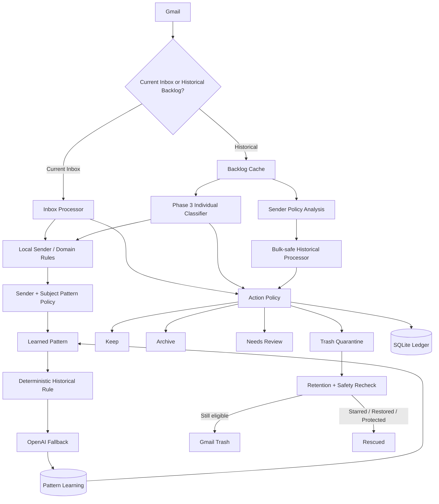

# Gmail AI Organizer

A production-oriented Python application that organizes Gmail with a hybrid of deterministic rules, learned sender/subject patterns, and OpenAI classification.

It is designed for both **continuous Inbox maintenance** and **large historical mailbox cleanup**. The system prefers local rules whenever possible, uses AI only when the message is genuinely ambiguous, records every decision in SQLite, and places low-value mail in a reversible quarantine before it can reach Gmail Trash.

## Highlights

- Gmail API integration with OAuth and automatic token refresh/re-authorization
- Structured AI classification with categories, lifecycle state, importance, confidence, and action requirements
- Current Inbox processing plus resumable historical cleanup
- Sender rules, sender-policy analysis, subject-pattern policies, and deterministic historical rules
- Local learning from repeated high-confidence historical classifications
- SQLite-backed processing ledger and backlog cache
- Safe `keep`, `archive`, `review`, and `trash_candidate` actions
- 14-day trash quarantine with rescue checks for starred/restored/protected mail
- Autonomous worker that drains the historical backlog, refreshes its mailbox cache daily, and then continues monitoring the Inbox
- Dashboard and preview modes for visibility and auditing
- GitHub Actions CI for compilation and unit tests

## Architecture



## Classification model

Each message is assigned:

- `category`
- `subcategory`
- `email_state` (`active`, `completed`, `informational`, `promotional`, `unknown`)
- `importance`
- `action_required`
- `confidence`
- `recommended_action`
- `classification_source`

The final action policy is intentionally more conservative than the raw model recommendation. Financial, security, school, career, shopping/order, receipt, travel, and personal categories are protected from automatic trashing.

## Safety model

`trash_candidate` does **not** immediately delete mail. The organizer applies `AI/Trash Candidates`, removes the message from the Inbox, and records the quarantine in SQLite. After the configured retention period, cleanup re-checks Gmail before moving the message to Trash.

A message is rescued or protected if, among other safeguards, it is starred, restored to the Inbox, carries an important/action/review label, belongs to a protected category, or no longer carries the quarantine label.

## Modes

```bash
python main.py                         # Process current Inbox mail
python main.py --once                  # One complete production cycle
python main.py --auto                  # Continuous production worker
python main.py --cleanup               # Process expired quarantine
python main.py --phase3-dashboard      # Backlog/progress dashboard
python main.py --backlog-scan          # Refresh historical metadata cache
python main.py --sender-policy-preview # Learn safe sender policies (no Gmail changes)
python main.py --historical-preview    # Preview approved bulk historical work
python main.py --historical-live       # Run approved bulk historical batch
python main.py --historical-classify-run-preview
python main.py --historical-classify-live
```

## Local configuration

Copy `.env.example` to `.env`, provide `OPENAI_API_KEY`, and place a Google OAuth desktop client file at `credentials.json`. The first Gmail connection opens a browser authorization flow and writes `token.json` locally.

Sensitive/runtime files are intentionally excluded from Git:

- `.env`
- `credentials.json`
- `token.json`
- SQLite databases
- logs
- virtual environments

## Autonomous operation

`python main.py --auto` runs the production pipeline continuously:

1. process new Inbox messages;
2. learn policies for promotion-heavy historical senders;
3. drain bulk-safe historical messages;
4. classify remaining historical messages through the Phase 3 hierarchy;
5. run quarantine cleanup periodically;
6. continue polling the Inbox after the historical backlog reaches zero.

Processing is resumable because successful Gmail actions are recorded immediately. If the process stops, previously completed message IDs are skipped on restart.

### macOS background service

The repository includes `scripts/install_mac_service.sh`, which installs a per-user launchd agent using the project's virtual environment. It starts the autonomous worker at login, restarts it if it exits, and writes runtime output under `logs/`. `scripts/uninstall_mac_service.sh` removes the service.

## Testing

```bash
python -m py_compile *.py
python -m unittest discover -s tests -v
```

## Tech stack

Python, Gmail API, OpenAI API, Pydantic, SQLite, OAuth 2.0.
